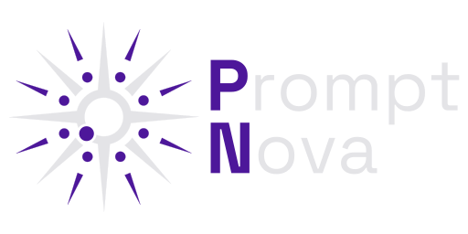

# 


**PromptNova** is a desktop application designed to centralize the storage and utilization of prompts, primarily for AI interactions but also for other types of commands. It provides an organized, agile environment with seamless integration across Windows, Linux, and macOS, allowing users to access and insert their prompts into any text field with just a keyboard shortcut.

## Features

- Organized prompt storage with categories and tags
- Floating window with global keyboard shortcuts
- Smart placeholder system for dynamic content
- Context code integration with drag & drop support
- Multiple workspace support
- Cross-platform compatibility (Windows, Linux, macOS)
- Import/export functionality with multiple formats
- Modern, responsive interface built with React and Tailwind CSS

## Installation

```bash
npm install
```

## Usage

```bash
npm start
```

## Development

1. Clone the repository
2. Install dependencies
3. Start the development server

```bash
npm run dev
```

## License

This project is licensed under the GNU License - see the [LICENSE](LICENSE) file for details.